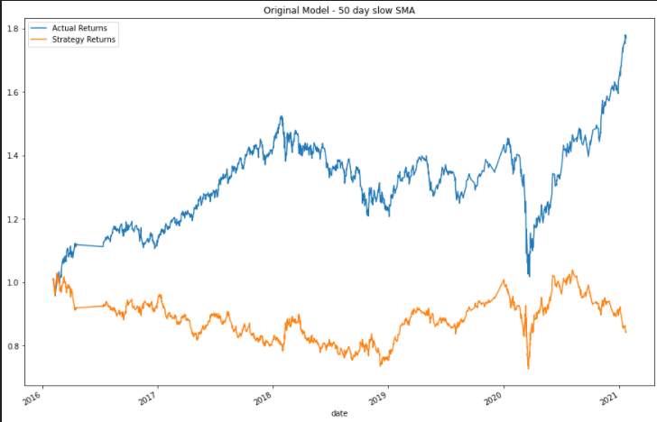
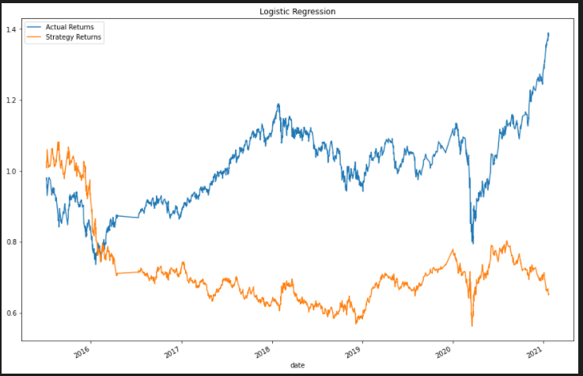

# bootcamp_challenge_14
This Jupyter lab notebook uses machine learning models to enhance the trading signals of a trading algorithm.

---

## Analysis Conclusion

The SVC Model with the original data resulted in a decent accuracy (56%), and a good precision on the long trade signal. However there was a fair bit of noise as the recall for the buy signal was only .56.

This model did a terrible job of identifying the short trade signal with a precision and recall of 0.

When observing the results in a graph, we can see that the inabilty to correctly predict the short selling signal led to poor performance of the strategy vs. the actual returns.

In order to fine tune the model, several methods were attempted.

The first adjustment was to the time period. I tried slicing the model into 2 different time periods to see if the moving averages were better at boosting performance in the begining or end of the data set. The thinking behind this was that as the market conditions chaged, the model might perform differently.

The First slice was looking only at the data from 2015 thru 2016. Despite some early success, the model seems to lag  the actual returns.

The second attempt was looking at data from 2018-2019.

It seems that this time period was more favorable to our model as it outperformed the actual returns quite nicely. Since the training data is selected from the first 3 months of the dataset, it could be that the data in early 2015 provides a poor input for the machine learning model.

The next step was seeing if adjusting the slow or fast moving average lengths could be another area where we could improve our model.

I first attempted to adjust the fast sma from 4 days to 21 days.

We improved greatly on our model's ability to predict the short sell signal by going with a longer "fast" moving average. However, that was at the expense of total model accuracy as you can see the precision of the buy signal fell precipitously to .36, and total accuracy was now < .50 

The Strategy returns made by making the adjustment also were underwhelming.

Well, if making the fast moving average longer didn't help, perhaps changing the slow moving average would work. I changed the slow moving average to 50 days and here were the results:

Not much to look at here. We are still underperforming, and the accuracy of the machine learning model keeps getting worse.

One other trick to try was using the original data, but trying a different Machine Learning Classifier. I decided to use the LogisticRegression classifier.

While the LogisticRegression classifier did do a better job correctly predicting the sell short signals, the Strategy returns relative to the actual returns were still poor.

When looking at all of the above, I think the most effective means of tuning this trading algorithm was to drop the earlier data, and train the model on more recent market info. I chose 2018 as my cutoff as it still gave a robust amount of data to train and test the model, and it seems to have worked.

As you can see when using the more recent data, we see strategy outperformance up until the end of 2020. The divergence at the beginning of 2021 tells me that perhaps the market has begun to move on to a new dynamic where alternative trading strategies will have to be employed. At the end of the day though, this model seems to be a coin flip at best as the accuracy is consistantly around 50%, so you might want to try flipping a coin instead.

---

## Contributors

Neil Mendelow - https://www.linkedin.com/in/neil-mendelow/

---

## License

This code is covered by the MIT license.

